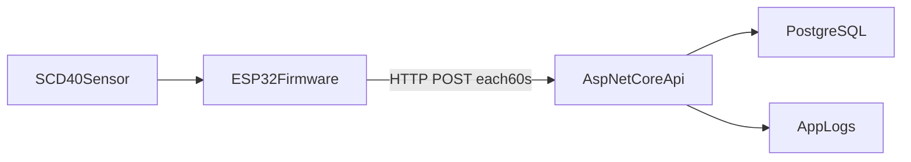

# План реализации ESP32 + SCD40 + ASP.NET Core + PostgreSQL

## 1) Архитектура и поток данных




- `ESP32` читает `CO2`, `temperature`, `humidity` с `SCD40` по `I2C`.
- Каждые `60s` формирует JSON и отправляет в `ASP.NET Core` endpoint.
- API валидирует payload и пишет в `PostgreSQL` таблицу измерений.
- При потере сети ESP32 хранит небольшую очередь в RAM и отправляет при восстановлении.

## 2) Электрическое подключение и базовые параметры

- Подключение `SCD40 -> ESP32` по `I2C`:
  - `VIN` -> `3.3V` (или по даташиту вашей платы)
  - `GND` -> `GND`
  - `SDA` -> GPIO `21`
  - `SCL` -> GPIO `22`
- Проверить I2C-адрес (`обычно 0x62`) сканером I2C.
- Настроить интервал опроса `60s` (SCD40 поддерживает периодические измерения).

## 3) Прошивка ESP32 (Arduino framework)

Рекомендуемая структура:

- [Arduino/src/main.cpp](Arduino/src/main.cpp)
- [Arduino/src/config.h](Arduino/src/config.h)
- [Arduino/src/sensor_scd40.h](Arduino/src/sensor_scd40.h)
- [Arduino/src/sensor_scd40.cpp](Arduino/src/sensor_scd40.cpp)
- [Arduino/src/network_client.h](Arduino/src/network_client.h)
- [Arduino/src/network_client.cpp](Arduino/src/network_client.cpp)

Основные задачи:

- Инициализация `Wire`, `SCD40`, `WiFi`.
- `NTP` синхронизация времени для поля `measured_at` (или сервер ставит время сам).
- Цикл:
  - ждать готовность измерения;
  - читать `co2_ppm`, `temperature_c`, `humidity_rh`;
  - отправлять JSON в API;
  - при неуспехе: положить в локальную очередь (ограничить размер, например 30-60 записей).
- Повторные попытки отправки очереди при следующем успешном подключении.

Пример payload:

```json
{
  "device_id": "esp32-lab-01",
  "measured_at": "2026-02-10T14:30:00Z",
  "co2_ppm": 612,
  "temperature_c": 24.15,
  "humidity_rh": 46.2,
  "rssi": -58,
  "fw_version": "1.0.0"
}
```

## 4) ASP.NET Core API (прием и запись)

Рекомендуемая структура:

- [server/src/AirQuality.Api/Program.cs](server/src/AirQuality.Api/Program.cs)
- [server/src/AirQuality.Api/Endpoints/IngestEndpoint.cs](server/src/AirQuality.Api/Endpoints/IngestEndpoint.cs)
- [server/src/AirQuality.Api/Contracts/AirSampleDto.cs](server/src/AirQuality.Api/Contracts/AirSampleDto.cs)
- [server/src/AirQuality.Infrastructure/Persistence/AirDbContext.cs](server/src/AirQuality.Infrastructure/Persistence/AirDbContext.cs)
- [server/src/AirQuality.Infrastructure/Persistence/Entities/AirSample.cs](server/src/AirQuality.Infrastructure/Persistence/Entities/AirSample.cs)

Шаги:

- Поднять минимальный API `POST /api/air-samples`.
- Валидация входных данных (диапазоны, обязательные поля, device_id).
- Запись в БД через `EF Core` или `Dapper`.
- Добавить API key (header `X-Api-Key`) как минимум для локальной безопасности.
- Логирование ошибок/успешных вставок и health endpoint (`/health`).

## 5) PostgreSQL схема

Рекомендуемая таблица:

- `air_samples`
  - `id` bigserial PK
  - `device_id` text not null
  - `measured_at` timestamptz not null
  - `co2_ppm` int not null
  - `temperature_c` numeric(5,2) not null
  - `humidity_rh` numeric(5,2) not null
  - `rssi` int null
  - `fw_version` text null
  - `received_at` timestamptz not null default now()

Индексы:

- `(device_id, measured_at desc)`
- `(measured_at desc)`

## 6) Надежность и эксплуатация

- Таймаут HTTP-запроса на ESP32: `3-5s`.
- Backoff при ошибках сети: `5s -> 15s -> 30s`.
- Очередь в памяти с политикой `drop oldest` при переполнении.
- Watchdog/reboot strategy, если Wi-Fi не поднимается долго.
- На API стороне: ограничение размера payload и rate limit.

## 7) План тестирования

- Unit-тесты API валидации DTO.
- Интеграционный тест вставки в PostgreSQL.
- Полевая проверка:
  - отключить Wi-Fi на 3-5 минут;
  - убедиться, что ESP32 буферизует и затем догружает данные;
  - проверить целостность в БД (нет дублей/потерь).
- Проверка калибровки SCD40 в стабильных условиях.

## 8) Порядок реализации (рекомендуемый)

1. Поднять PostgreSQL + создать таблицу.
2. Сделать ASP.NET Core endpoint и ручной POST через Postman/curl.
3. Подключить SCD40 к ESP32 и убедиться в корректном чтении.
4. Добавить отправку JSON в API раз в минуту.
5. Добавить очередь/ретраи.
6. Прогнать тесты надежности и зафиксировать baseline метрики.

## 9) Что можно добавить во 2-й итерации

- MQTT вместо HTTP для лучшей телеметрии.
- TLS внутри локальной сети.
- Grafana/Metabase дашборды.
- OTA-обновления ESP32 прошивки.
- Правила алертов по CO2 (например > 1000 ppm).

